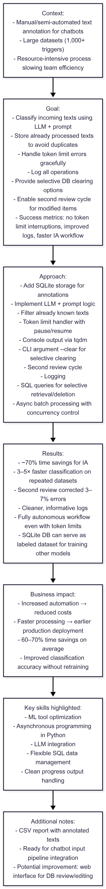
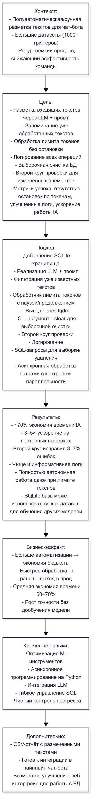

# LLM Labeler with Memory and Adaptive Load

---

## 🇬🇧 English version
**Tech stack:** Python • SQLite • Pandas • Asyncio • TQDM • LLM API (via LLMChecker) • Nest Asyncio • Argparse • OS/IO • SQL • Regular Expressions • Bash Arguments  

---

### Context
Before this project, text annotation for chatbot tools was semi-automated: Intent Analysts read and labeled texts manually, sometimes working with datasets containing over 1,000 triggers. This process was resource-intensive and slowed down team efficiency.

---

### Goal
**Main objectives:**
1. Build a tool to classify incoming texts (fit/not fit for a given class) using an LLM and a well-crafted prompt.
2. Store already processed texts to avoid re-annotation.
3. Handle token limit errors without stopping the process.
4. Log all operations.
5. Provide selective database clearing options (all / yes / no).
6. Enable a second review cycle for modified items only.

**Success metrics:**
- No token limit interruptions.
- Increased log readability.
- IA workflow acceleration.

---

### Approach
**Action plan:**
1. Add SQLite storage for annotations.
2. Implement LLM + prompt logic.
3. Filter already known texts before sending to LLM.
4. Add token limit handler with pause & resume.
5. Rewrite console output using tqdm.
6. Implement CLI argument `--clear` for selective clearing.
7. Add second review cycle.
8. Implement logging.

**Methods & algorithms:**
- SQL queries for selective retrieval and deletion.
- Asynchronous batch processing with concurrency control.
- Progress bar with manual updates.

**Iterative development:**
1. Implemented memory + filtering.
2. Added token limit handling.
3. Added CLI clearing.
4. Optimized output.

**LLM usage:** Yes — core classification logic.

---

### Results
**Quantitative:**
- ~70% IA time savings.
- 3–5× faster classification on repeated datasets.
- Second review corrected 3–7% of errors.

**Qualitative:**
- Cleaner, more informative logs.
- Fully autonomous — no manual intervention required even with token limits.

**Side effects:**
- SQLite DB can serve as a labeled dataset source for training other models.

---

### Business Impact
- Increased automation → reduced costs.
- Faster processing → quicker production deployment.
- 60–70% time savings on average.
- Improved classification accuracy via second review without retraining the model.

### Data Pipeline

---

## 🇷🇺 Русская версия
**Технологии:** Python • SQLite • Pandas • Asyncio • TQDM • LLM API (через LLMChecker) • Nest Asyncio • Argparse • OS/IO • SQL • Регулярные выражения • Bash-аргументы  

---

### Контекст
До проекта разметка текстов для чат-бота происходила полуавтоматически: интент аналитики читали и размечали тексты вручную, иногда с датасетами в 1000+ срабатываний. Это было ресурсозатратно и снижало эффективность команды.

---

### Цель
**Основные задачи:**
1. Разметка входящих текстов (подходит/не подходит под класс) через LLM и продуманный промт.
2. Запоминание уже размеченных текстов для исключения повторной обработки.
3. Обработка ошибок лимита токенов без остановки работы.
4. Логирование всех операций.
5. Возможность выборочной очистки базы (all / yes / no).
6. Второй круг проверки только для изменённых элементов.

**Метрики успеха:**
- Отсутствие остановок из-за лимита токенов.
- Повышение читаемости логов.
- Ускорение работы IA.

---

### Подход
**План действий:**
1. Добавить дополнительное хранилище.
2. Реализовать ллм и промт.
3. Фильтровать уже известные тексты перед отправкой в LLM.
4. Добавить обработчик лимита токенов (пауза и продолжение).
5. Переписать вывод через tqdm.
6. CLI-аргумент `--clear` для выборочной очистки.
7. Второй круг проверки.
8. Логирование.

**Методы и алгоритмы:**
- SQL-запросы для выборки/удаления.
- Асинхронная обработка батчами с контролем параллельности.
- Прогресс-бар с ручным обновлением.

**Итеративная разработка:**
1. Память + фильтрация.
2. Обработка лимитов.
3. CLI-очистка.
4. Оптимизация вывода.

**Использование LLM:** Да — основная логика классификации.

---

### Результаты
**Количественные:**
- ~70% экономии времени IA.
- 3–5× ускорение на повторных выборках.
- Второй круг исправил 3–7% ошибок.

**Качественные:**
- Чище и информативнее логи.
- Полностью автономная работа даже при лимите токенов.

---

### Бизнес-эффект
- Больше автоматизации → экономия бюджета.
- Быстрее обработка → раньше выход в прод.
- Экономия 60–70% времени.
- Рост точности.

### Пайплайн

