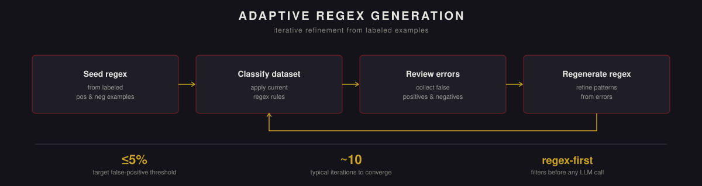

  

<a href="README.ru.md">Русская версия →</a>

# Automated Text Labeling: LLM Classifier + Self-Refining Regex Generator

> **Note on source code.** This repository documents methodology, design decisions, and results only. The implementation is proprietary to the employer where this project was built and is not published here.

Two connected tools that replaced fully manual text annotation: an LLM-based labeler with memory and resilient batch processing, and a self-refining regex generator built on top of it that learns to catch the same messages more cheaply — without ever calling the LLM.

## At a glance

| | |
|---|---|
| **IA time savings (labeler)** | ~70% |
| **Speed on repeated datasets** | 3–5× faster |
| **Error correction from second review** | 3–7% of items corrected |
| **Regex convergence target** | ≤5% false-positive rate |
| **Typical iterations to converge** | ~10 |
| **Status** | adopted as a standing internal tool; design handed off to the team now building chatbot automation services, as a candidate for a standalone service |

## Problem

Text annotation for chatbot tools — sometimes over 1,000 triggers per dataset — was done manually by Intent Analysts. It was slow, repetitive, and didn't scale as dataset size grew.

## Part 1 — LLM labeler with memory

**What it does.** Classifies incoming text as fit / not fit for a given class using an LLM behind a purpose-built prompt, while solving the operational problems that make LLM batch jobs fragile in practice:

- **Memory (SQLite).** Already-labeled texts are stored and filtered out before being sent to the LLM again — no redundant calls, no redundant cost.
- **Resilience.** Token-limit errors pause and resume the job automatically instead of crashing the whole run.
- **Selective clearing.** A `--clear` CLI flag supports clearing all / only positive / only negative labels, so re-runs don't require starting from zero.
- **Second review cycle.** A follow-up pass re-checks only items that changed since the last run, catching a further 3–7% of labeling errors without re-processing the full dataset.
- **Logging.** Every operation is logged in a readable format, not just success/failure counts.

## Part 2 — Self-refining regex generator

**Why.** Even a cost-optimized LLM call is more expensive than a regex match. This tool automatically writes and refines regex patterns from the same labeled examples, to catch the same messages cheaply and let the LLM be reserved for cases that actually need it.

**How it works.** The loop shown above: an initial regex is seeded from labeled positive and negative examples, run against the dataset, and every false positive/negative it produces is fed back into regenerating a tighter set of patterns. This repeats — typically within on the order of ten iterations — until the false-positive rate drops to the target threshold of ≤5%. The same memory mechanism from Part 1 keeps each iteration fast, since previously-labeled examples don't need to be re-fetched or re-evaluated from scratch.

**A limitation worth naming.** Widening or narrowing a regex to fix one class of error can shift what else it catches or misses — so the loop was designed to keep expanding the labeled example pool across iterations rather than tuning against a fixed, static sample.

## Results

- Roughly 70% reduction in Intent Analyst time spent on manual labeling, with 3–5× faster turnaround on datasets that overlap with previously labeled data.
- A second, targeted review cycle caught an additional 3–7% of labeling errors at negligible extra cost.
- The regex layer compounds these savings further: any message a regex can confidently classify never needs an LLM call at all, on top of the labeler's own time savings.

## Business impact

- Increased automation of a previously manual workflow, reducing both analyst time and per-message classification cost.
- Faster path to production for newly labeled datasets.
- Improved accuracy through a cheap second review pass, with no model retraining required.
- The labeled SQLite store is, in principle, reusable as a training dataset for other models — this hasn't been put into practice, but the data is structured in a way that would support it.

## Tech stack

Python · SQLite · pandas · asyncio · nest_asyncio · tqdm · argparse · SQL · regular expressions · LLM API

---

Individual project completed as part of a Data / Intent Analytics role. Described here for portfolio purposes; production code is not publicly available.
